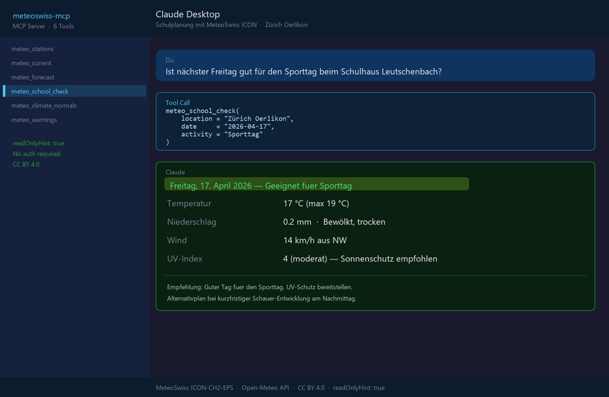

# 🌦️ meteoswiss-mcp

[](https://github.com/malkreide/meteoswiss-mcp/actions/workflows/ci.yml)
[](https://pypi.org/project/meteoswiss-mcp/)
[](https://pypi.org/project/meteoswiss-mcp/)
[](LICENSE)
[](https://github.com/malkreide/swiss-public-data-mcp)

**MCP server for Swiss weather and climate data from MeteoSwiss.**

Connects AI models to the SwissMetNet measurement network (160+ stations, 10-minute interval), MeteoSwiss ICON-CH1/CH2-EPS forecasts and climate normals 1991–2020. Part of the [swiss-public-data-mcp](https://github.com/malkreide/swiss-public-data-mcp) portfolio.

🇩🇪 [Deutsche Version](README.de.md)

---

## Demo query (anchor example)



```
How suitable is next Wednesday for the sports day at Leutschenbach school?
```

→ `meteo_school_check(location="Zürich Oerlikon", activity="Sporttag")` returns a 🟢/🟡/🔴 traffic light for each day of the coming week — straight from the MeteoSwiss ICON model.

**Combined with [swiss-environment-mcp](https://github.com/malkreide/swiss-environment-mcp):**

```
How were air quality and weather at Leutschenbach school yesterday?
```

→ `meteo_current(station='REH')` + `env_nabel_current(station='ZUE')` = a complete environmental picture.
→ [More use cases by audience](EXAMPLES.md) →

---

## Tools (6)

| Tool | Description | Data source |
|------|-------------|-------------|
| `meteo_stations` | List SwissMetNet stations (filterable by canton) | Embedded |
| `meteo_current` | Current 10-min observations for a station | BGDI STAC API |
| `meteo_forecast` | 1–16 day forecast for a place or coordinates | Open-Meteo / MeteoSwiss ICON |
| `meteo_school_check` | 🟢/🟡/🔴 traffic light for outdoor school events | Open-Meteo / MeteoSwiss ICON |
| `meteo_climate_normals` | Monthly climate normals 1991–2020 | Embedded (KLO, SMA, BER, LUG, GVE) |
| `meteo_warnings` | Active official weather warnings (storm, thunderstorm, heat, forest fire, …) — nationwide, by canton, or by PLZ | MeteoSwiss App-API + opendata.swiss |

### Tool annotations (MCP hints)

All tools carry explicit [MCP annotations](https://modelcontextprotocol.io/specification/draft/server/tools#tool-annotations) — relevant for the client approval UI and for the LLM's safety decisions.

| Tool | `readOnlyHint` | `destructiveHint` | `idempotentHint` | `openWorldHint` |
|------|---|---|---|---|
| `meteo_stations` | ✅ | ✗ | ✅ | ✗ (curated list) |
| `meteo_current` | ✅ | ✗ | ✗ (live data) | ✅ (upstream STAC) |
| `meteo_forecast` | ✅ | ✗ | ✗ (live data) | ✅ (upstream Open-Meteo) |
| `meteo_school_check` | ✅ | ✗ | ✗ (live data) | ✅ (geocoding + forecast) |
| `meteo_climate_normals` | ✅ | ✗ | ✅ | ✗ (embedded normals) |
| `meteo_warnings` | ✅ | ✗ | ✗ (live data) | ✅ (MeteoSwiss App-API) |

**Read rules**: all 6 tools are `readOnly + non-destructive` — the server fundamentally cannot write or delete anything. `idempotentHint=False` marks tools that return different values depending on when they are called.

### MCP protocol version

| Aspect | Value |
|---|---|
| Tested spec versions | `2024-11-05`, `2025-03-26`, `2025-06-18` (via the `mcp[cli]` SDK) |
| MCP SDK version | see `pyproject.toml` → `mcp[cli]>=2.0.0,<3` (the `MCPServer` API from `mcp.server.mcpserver`) |
| Update policy | Dependabot watches `mcp[cli]`; spec bumps are documented in the CHANGELOG with a "Tool Definition Changes" marker |

→ Full roadmap & update strategy: [`docs/roadmap.md`](docs/roadmap.md)

---

## Quick start

### Claude Desktop

```json
{
  "mcpServers": {
    "meteoswiss": {
      "command": "uvx",
      "args": ["meteoswiss-mcp"]
    }
  }
}
```

### Claude Desktop (local development)

```json
{
  "mcpServers": {
    "meteoswiss": {
      "command": "uv",
      "args": ["run", "--directory", "/path/to/meteoswiss-mcp", "meteoswiss-mcp"]
    }
  }
}
```

### Cloud / Render.com (Streamable HTTP)

Configuration via ENV variables (the CLI flags `--http` / `--port N` still work as an override):

| Variable | Default | Meaning |
|---|---|---|
| `MCP_TRANSPORT` | `stdio` | `stdio` or `streamable-http` |
| `MCP_HOST` | `127.0.0.1` | Bind address — **never change locally** |
| `MCP_PORT` | `8000` | Port |
| `MCP_ALLOW_ANY_HOST` | _unset_ | Must be set to `1` to allow the server to bind to `0.0.0.0` (containers/cloud only) |
| `MCP_LOG_LEVEL` | `INFO` | `DEBUG` / `INFO` / `WARNING` / `ERROR` — structured JSON logs on stderr |
| `MCP_ALLOWED_ORIGINS` | _unset_ | Comma-separated list of allowed origins for CORS. Empty = CORS disabled (same-origin only). `Mcp-Session-Id` is exposed automatically. |
| `MCP_API_KEY` | _unset_ | If set: every request except `/health` requires `X-API-Key: <key>` or `Authorization: Bearer <key>`. Constant-time comparison. |
| `MCP_STATELESS_HTTP` | `0` | `1` enables the SDK's stateless mode → each HTTP request opens a new session. Prerequisite for multi-replica deploys without sticky sessions (SCALE-002/003). |
| `OTEL_EXPORTER_OTLP_ENDPOINT` | _unset_ | If set + `pip install meteoswiss-mcp[otel]`: OpenTelemetry spans per tool call + automatic httpx instrumentation are sent as OTLP-HTTP to the collector. |
| `OTEL_SERVICE_NAME` | `meteoswiss_mcp` | Service name in the OTel resources |
| `MCP_CACHE_ENABLED` | `1` | `0` disables the TTL cache entirely (e.g. for end-to-end tests) |
| `MCP_CACHE_TTL_STAC` | `300` | TTL in seconds for STAC SMN observations (default 5 min) |
| `MCP_CACHE_TTL_OPEN_METEO` | `600` | TTL for ICON forecasts (default 10 min) |
| `MCP_CACHE_TTL_GEOCODING` | `3600` | TTL for geocoding lookups (default 1 h) |
| `MCP_CACHE_TTL_OPENDATA` | `3600` | TTL for the opendata.swiss catalogue (default 1 h) |
| `MCP_CACHE_TTL_WARNINGS` | `300` | TTL for warnings (MeteoSwiss App-API / structured override; default 5 min) |
| `MCP_CLIMATE_NORMALS_PATH` | _unset_ | Path to a JSON file with additional climate normals — see `data/climate-normals.example.json` |
| `MCP_WARNINGS_API_URL` | _unset_ | **Override** for the default MeteoSwiss App-API source: URL of a structured MeteoSwiss warnings API (e.g. the future OGD warnings REST endpoint). The host must be on the egress allow-list. Schema-tolerant (GeoJSON `features`, a `warnings` array or `items`). Unset → live App-API. |
| `MCP_CLIMATE_NORMALS_URL_TEMPLATE` | _unset_ | URL template for runtime lookup of climate normals (for stations without embedded or JSON values). Tokens: `{station}` (lowercase), `{STATION}` (uppercase), `{param}` (MeteoSwiss code `tre200m0`/`rre150m0`/`sre000m0`). Example: `https://data.geo.admin.ch/.../{station}/{param}.txt`. The host must be on the egress allow-list. |

```bash
# Local test (safe, loopback only)
MCP_TRANSPORT=streamable-http meteoswiss-mcp

# Container / Render
MCP_TRANSPORT=streamable-http MCP_HOST=0.0.0.0 MCP_ALLOW_ANY_HOST=1 meteoswiss-mcp
```

#### Docker / Render

The repo includes a production-ready **multi-stage Dockerfile** (non-root user, HEALTHCHECK) and a **`render.yaml`** blueprint:

```bash
# Build + test locally
docker build -t meteoswiss-mcp .
docker run --rm -p 8000:8000 meteoswiss-mcp
curl http://127.0.0.1:8000/health   # → {"status":"ok","service":"meteoswiss-mcp"}
```

On Render: "New → Blueprint" → select the repo. Defaults (plan `starter`, Frankfurt, single instance) are set in `render.yaml`.

**Important:** `numInstances: 1` is set deliberately — sticky-session routing for multi-replica (audit SCALE-002/003) is not yet implemented.

#### Structured logging

All tool invocations, upstream failures and egress blocks are emitted as JSON events on `stderr` (stdio-transport safe). Example:

```json
{"tool": "meteo_forecast", "days": 7, "has_coords": false, "event": "tool_invoked", "level": "info", "timestamp": "2026-05-20T07:00:00Z"}
{"tool": "meteo_forecast", "endpoint": "geocoding", "error_type": "HTTPStatusError", "event": "upstream_failed", "level": "warning", "timestamp": "..."}
{"url": "https://evil.example.com/", "method": "GET", "reason": "host not in allow-list", "event": "egress_blocked", "level": "warning", "timestamp": "..."}
```

#### HTTP-mode security

- `MCP_HOST` deliberately defaults to `127.0.0.1` so that `--http` on a dev laptop is not accidentally exposed to the local subnet (audit finding SEC-016).
- All outgoing HTTP calls (including redirect follows) are validated against an allow-list: `data.geo.admin.ch`, `api.open-meteo.com`, `geocoding-api.open-meteo.com`, `opendata.swiss`. Other hosts and IP literals (in particular `169.254.169.254`, RFC1918) are rejected with `EgressBlocked` (SEC-004 / SEC-021).
- **CORS**: disabled by default (same-origin only). Browser clients (e.g. claude.ai web) need `MCP_ALLOWED_ORIGINS=<csv>` — the `Mcp-Session-Id` header is then automatically in `Access-Control-Expose-Headers` (SDK-004).
- **API-key auth**: disabled by default. In a production HTTP setup, always set `MCP_API_KEY=<random>` — requests without a valid `X-API-Key` or `Authorization: Bearer …` are rejected with 401 (SEC-009 / SEC-013). `/health` stays open for container health probes.

#### Example: production HTTP stack

```bash
# 32 bytes of randomness as the auth key
export MCP_API_KEY=$(python -c "import secrets; print(secrets.token_urlsafe(32))")

MCP_TRANSPORT=streamable-http \
MCP_HOST=0.0.0.0 \
MCP_ALLOW_ANY_HOST=1 \
MCP_ALLOWED_ORIGINS=https://app.example.com \
MCP_API_KEY="$MCP_API_KEY" \
meteoswiss-mcp
```

---

## Example queries

### School planning

```
Which days next week are suitable for a sports day in Zürich?
→ meteo_school_check(location="Zürich", activity="Sporttag")

What will the weather be at Leutschenbach school on Friday?
→ meteo_forecast(location="Zürich Oerlikon", days=5)

Show me current readings from the nearest MeteoSwiss station to Zürich-Schwamendingen.
→ meteo_current(station="REH")
```

### Climate comparison

```
How much rain normally falls in June in Zürich?
→ meteo_climate_normals(station="KLO")

Is Lugano really much sunnier than Zürich? Show me the annual values.
→ meteo_climate_normals(station="LUG") + meteo_climate_normals(station="SMA")
```

### Infrastructure & environment

```
Are there currently any weather warnings for the canton of Zürich?
→ meteo_warnings(canton="ZH")

Show me a 10-day forecast for the Heerenschürli sports facility with hourly values.
→ meteo_forecast(location="Sportanlage Heerenschürli Zürich", days=10, hourly=True)
```

---

## Architecture

```
Claude Desktop / AI agent
        │
        │ MCP (stdio / Streamable HTTP)
        ▼
meteoswiss-mcp (MCPServer)
        │
        ├── meteo_stations ──────────────── [embedded: ~20 SMN stations]
        │
        ├── meteo_current ───────────────── BGDI STAC API
        │                                   data.geo.admin.ch/api/stac/v1
        │                                   Collection: ch.meteoschweiz.ogd-smn
        │
        ├── meteo_forecast ──────────────── Open-Meteo
        ├── meteo_school_check ──────────── api.open-meteo.com/v1/meteoswiss
        │                                   (MeteoSwiss ICON-CH1/CH2-EPS, 1–2 km)
        │
        ├── meteo_climate_normals ───────── [embedded: normals 1991–2020]
        │
        └── meteo_warnings ──────────────── app-prod-ws.meteoswiss-app.ch
                                            (MeteoSwiss App-API) + opendata.swiss
```

### Data sources

| Source | URL | License |
|--------|-----|---------|
| BGDI STAC API (MeteoSwiss OGD) | `data.geo.admin.ch/api/stac/v1` | CC BY 4.0 |
| Open-Meteo (MeteoSwiss ICON) | `api.open-meteo.com/v1/meteoswiss` | CC BY 4.0 |
| Open-Meteo Geocoding | `geocoding-api.open-meteo.com` | CC BY 4.0 |
| opendata.swiss CKAN | `opendata.swiss/api/3/action` | CC BY 4.0 |
| MeteoSwiss App-API (warnings) | `app-prod-ws.meteoswiss-app.ch/v1/plzDetail` | CC BY 4.0 |

---

## Safety & limits

| Aspect | Details |
|--------|---------|
| **Access** | Read-only (`readOnlyHint: true` on all tools) — the server cannot modify or delete any data |
| **Personal data** | No personal data — all sources are aggregated, publicly available open data |
| **Rate limits** | Built-in per-query caps: max 50 results per API call, 30 s timeout |
| **Authentication** | No API keys required — all data sources are publicly accessible |
| **Licenses** | All data under CC BY 4.0 (MeteoSwiss Open Government Data) |
| **Terms of Service** | Subject to the ToS of the respective data sources: [MeteoSwiss OGD](https://www.meteoswiss.admin.ch/services-and-publications/service/open-government-data.html), [Open-Meteo](https://open-meteo.com/en/terms), [opendata.swiss](https://opendata.swiss/en/terms-of-use) |

---

## Known limitations

| ID | Tool | Description |
|----|------|-------------|
| BUG-01 | `meteo_current` | STAC asset structure can vary per station; fallback to a direct link is implemented |
| LIM-01 | `meteo_climate_normals` | Only 5 stations embedded (KLO, SMA, BER, LUG, GVE); the rest via an opendata.swiss link |
| LIM-02 | `meteo_warnings` | Live warnings come from the **MeteoSwiss App-API** (`plzDetail`) — public and unauthenticated, but undocumented (mobile-app backend, not the OGD REST API). There is no nationwide endpoint, so the countrywide view aggregates one representative capital PLZ per canton (sub-regional warnings outside that PLZ may be missed — narrow with `plz`/`canton`). `MCP_WARNINGS_API_URL` overrides it once the official OGD warnings REST API ships. |
| LIM-03 | `meteo_current` | Shows 10-min values in UTC; no automatic conversion to local time |

### Responsibility matrix — snow & precipitation (delineation vs. `swiss-environment-mcp`)

To avoid duplicating **snow and precipitation** data across the portfolio,
responsibilities are split as follows. `meteoswiss-mcp` owns atmospheric
precipitation and weather; `swiss-environment-mcp` (SLF domain) owns snow on the
ground and avalanche danger.

| Data | meteoswiss-mcp (MeteoSwiss) | swiss-environment-mcp (BAFU / SLF) |
|---|---|---|
| Precipitation amount (mm): measurement network, forecast, climate normals | ✅ `meteo_current` / `meteo_forecast` / `meteo_climate_normals` | ❌ |
| Snowfall as a current weather condition | ✅ `meteo_current` / `meteo_forecast` (weather code) | ❌ |
| Weather warnings (storm, thunderstorm, heat) | ✅ `meteo_warnings` | ❌ |
| Snow depth on the ground (`HS`) | ❌ | ✅ SLF IMIS / study-plot ¹ |
| Fresh snow 24 h (`HN_1D`) | ❌ | ✅ SLF ¹ |
| Avalanche danger level | ❌ | ✅ SLF avalanche bulletin ¹ |
| Natural-hazard warnings (flood, avalanche, wildfire) | ❌ | ✅ `env_flood_warnings`, `env_hazard_*`, `env_wildfire_danger` |

**Rule:** **atmospheric precipitation** (rain/snowfall as mm) plus weather,
forecast, warnings and climate normals belong to `meteoswiss-mcp`; snow **on the
ground** and **avalanche** danger belong to `swiss-environment-mcp` (SLF). The SLF
IMIS precipitation sensor is used there only as context for the snowpack and is
never exposed as a precipitation tool, so it does not duplicate MeteoSwiss.

¹ SLF/snow tools in `swiss-environment-mcp` are in preparation (Phase-1 live-probe
completed 2026-07-19, see that repo's `docs/probe-slf.md`); the demarcation is
fixed now so the two servers do not collide once implemented.

---

## Portfolio synergies

```
meteoswiss-mcp
    │
    ├── swiss-environment-mcp   Combine weather + air quality (NABEL)
    │                           "How were weather AND air at Leutschenbach school?"
    │
    └── zurich-opendata-mcp     School locations → weather forecast
                                "Which schools in Zürich have sports-day weather?"
```

---

## Testing

```bash
# Unit tests (no network)
PYTHONPATH=src pytest tests/ -m "not live" -v

# Live tests (real APIs) — also run daily at 05:17 UTC via
# .github/workflows/live-tests.yml, so a format change upstream
# surfaces even though the unit tests stay green.
PYTHONPATH=src pytest tests/ -m live -v

# Linting — install the local gates once with `pre-commit install`
# to run these (and the CI guards) before every commit.
ruff check src/ tests/
ruff format --check src/ tests/
```

---

## Development

```bash
git clone https://github.com/malkreide/meteoswiss-mcp
cd meteoswiss-mcp
pip install -e ".[dev]"
```

### MCP Inspector (local test)

```bash
PYTHONPATH=src npx @modelcontextprotocol/inspector python -m meteoswiss_mcp.server
```

---

## Contributing

See the [contributing guidelines](CONTRIBUTING.md) ([Deutsch](CONTRIBUTING.de.md)).

---

## Security

See the [security policy](SECURITY.md) ([Deutsch](SECURITY.de.md)) for the
security posture and how to report a vulnerability.

---

## License

MIT License – see [LICENSE](LICENSE).

Source data: MeteoSwiss Open Government Data (CC BY 4.0).
When using the data, cite: **Source: MeteoSwiss**.

---

## Author

**Hayal Oezkan** · [github.com/malkreide](https://github.com/malkreide)

---

## Related servers

[](https://github.com/malkreide/swiss-environment-mcp)
[](https://github.com/malkreide/zurich-opendata-mcp)
[](https://github.com/malkreide/swiss-transport-mcp)
</content>
</invoke>

<!-- mcp-name: io.github.malkreide/meteoswiss-mcp -->

<!-- BEGIN GENERATED: install -->
## Installation

Run via [`uv`](https://docs.astral.sh/uv/)'s `uvx` — no clone or manual install needed. Add to your MCP client config (`mcpServers` for Claude Desktop, Cursor and Windsurf; use a top-level `servers` key for VS Code in `.vscode/mcp.json`):

```json
{
  "mcpServers": {
    "meteoswiss-mcp": {
      "command": "uvx",
      "args": [
        "meteoswiss-mcp"
      ]
    }
  }
}
```
<!-- END GENERATED: install -->
